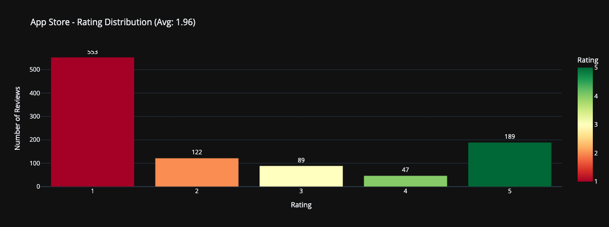
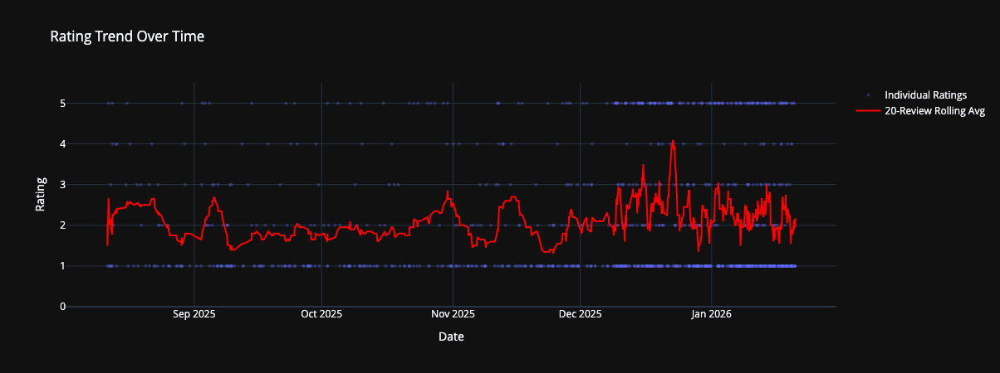
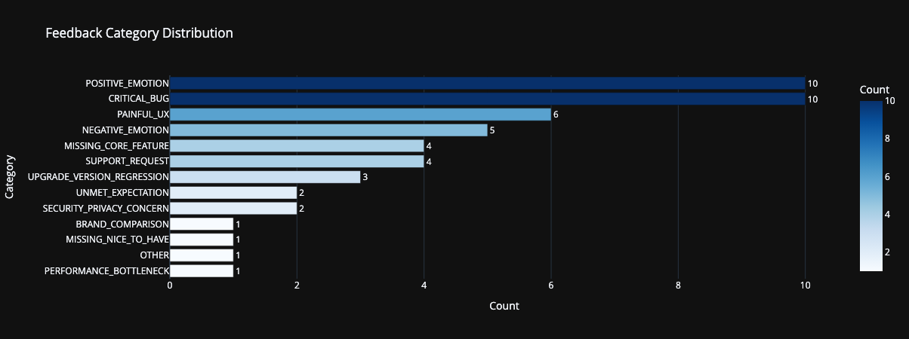
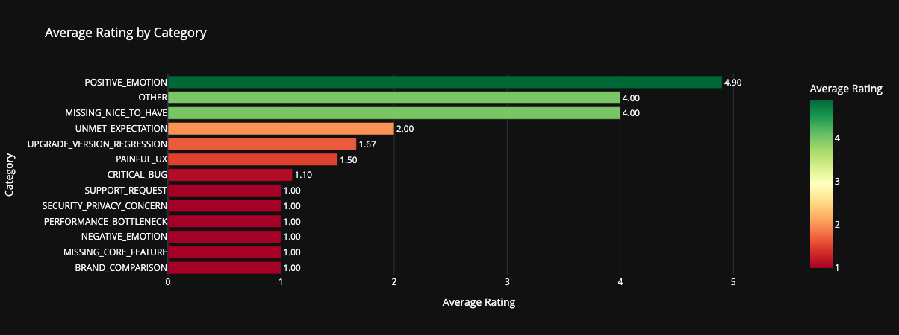

# 📱 App Store Insides

Analyze app reviews from Apple App Store and Google Play Store using AI to understand what your users really think, via [app-store-insides.ipynb](app-store-insides.ipynb) Jupyter Notebook.


## What Does It Do?

This tool helps you:
1. **Collect reviews** from Apple App Store and Google Play Store
2. **Classify them automatically** using AI into categories like "Bug", "Missing Feature", "Praise", etc.
3. **Visualize the results** with interactive charts
4. **Export everything** to CSV for further analysis

Perfect for app developers, product managers, and anyone who wants to understand user feedback at scale!

## Quick Start

### 1. Install

```bash
# Clone the repository
git clone <repository-url>
cd app-store-insides

# Install dependencies
uv sync

# Or use pip
pip install -e .
```

### 2. Setup OpenAI API Key

Create a `.env` file in the project root:

```env
OPENAI_API_KEY=your_api_key_here
OPENAI_MODEL=gpt-4o-mini
```

### 3. Run the Jupyter Notebook

Notebook: [app-store-insides.ipynb](app-store-insides.ipynb)

```bash
jupyter notebook app-store-insides.ipynb
```

The notebook walks you through everything step by step with examples!

## How to Use

### In Jupyter Notebook (Recommended)

Open `app-store-insides.ipynb` and follow the guided workflow:

1. **Configure your app** - Enter your app's ID
2. **Fetch reviews** - Get reviews from Apple and/or Google
3. **Visualize ratings** - See rating distributions
4. **Customize categories** - Define what categories you want
5. **Classify reviews** - Let AI categorize everything
6. **Analyze results** - See charts and distributions
7. **Export data** - Save to CSV

## Finding Your App ID

**Apple App Store:**
1. Find your app on apps.apple.com
2. Look at the URL: `https://apps.apple.com/.../id123456789`
3. Use the number: `123456789`

**Google Play Store:**
1. Find your app on play.google.com
2. Look at the URL: `https://play.google.com/store/apps/details?id=com.example.app`
3. Use the package name: `com.example.app`

## Customizing Categories

You can define your own categories in the notebook! The default ones are:

- **CRITICAL_BUG** - User reports a malfunction that blocks usage or causes major issues (e.g. data loss, crashes, login failures)
- **MINOR_BUG** - User reports a small or cosmetic issue that doesn't break core functionality
- **MISSING_CORE_FEATURE** - User requests a feature that is standard in similar apps or essential for usability
- **MISSING_NICE_TO_HAVE** - User requests an optional or convenience feature (e.g. dark mode, customization)
- **PAINFUL_UX** - User describes friction, confusion, or inefficiency in the interface or user flow
- **PERFORMANCE_BOTTLENECK** - User experiences slowness, unresponsiveness, or long loading times
- **NEGATIVE_EMOTION** - User expresses frustration, anger, disappointment, or distrust, regardless of technical cause
- **POSITIVE_EMOTION** - User expresses delight, appreciation, or love for the app or a specific feature
- **BRAND_COMPARISON** - User compares the app negatively or positively to a competitor (valuable for benchmarking)
- **LACK_OF_PERSONALIZATION** - User complains about having to re-enter data or inability to save preferences/settings
- **UNMET_EXPECTATION** - User expected something based on marketing, industry standards, or previous experience but it wasn't delivered
- **UPGRADE_VERSION_REGRESSION** - User says a recent update made things worse or removed features
- **SUPPORT_REQUEST** - User asks for help, clarification, or contact info
- **SECURITY_PRIVACY_CONCERN** - User raises concerns about data privacy, permissions, or trust
- **OTHER** - Feedback that doesn't clearly fit into any category

Just edit the `CLASSIFICATION_CATEGORIES` dictionary in the notebook!

## Visualizing Results

Example visualizations of the notebook

### Rating Distributions

Distribution of ratings for the fetched reviews.



### Rating Trend

Rating trend over time for the fetched reviews.



### Feedback Category Distribution

Distribution of feedback categories for the fetched reviews.



### Average Rating by Category

Average rating for each feedback category.



## Project Structure

```
app-store-insides/
├── src/app_store_insides/
│   ├── data_fetcher.py     # Fetch reviews from app stores
│   ├── classifier.py       # AI classification with OpenAI
│   ├── visualizer.py       # Create charts
│   └── utils.py            # Helper tools (pagination)
├── app-store-insides.ipynb # Main notebook (start here!)
├── .env.example            # Template for API key
└── README.md               # This file
```

## Contributing

Found a bug? Have an idea? Contributions are welcome!

## License

MIT License - use it however you want!
